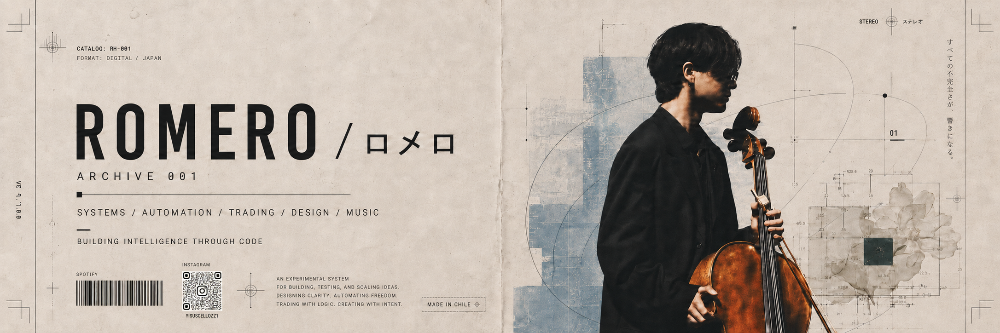

<p align="center">
  
</p>

<br>

<div align="center">

# ROMERO / ロメロ

### SYSTEMS / AUTOMATION / TRADING / DESIGN / MUSIC

`BUILDING INTELLIGENCE THROUGH CODE`  
`MADE IN CHILE`  
`ARCHIVE 001`

</div>

<br>

---

<br>

<table>
<tr>
<td width="50%" valign="top">

## 001 / ABOUT

I build experimental systems at the intersection of financial analysis, automation, interface design and music.

My work explores how code, data, sound and visual systems can transform information into decisions.

```txt
STATUS      ACTIVE
MODE        BUILDING
FOCUS       LONG TERM
ARCHIVE     001
LOCATION    CHILE
